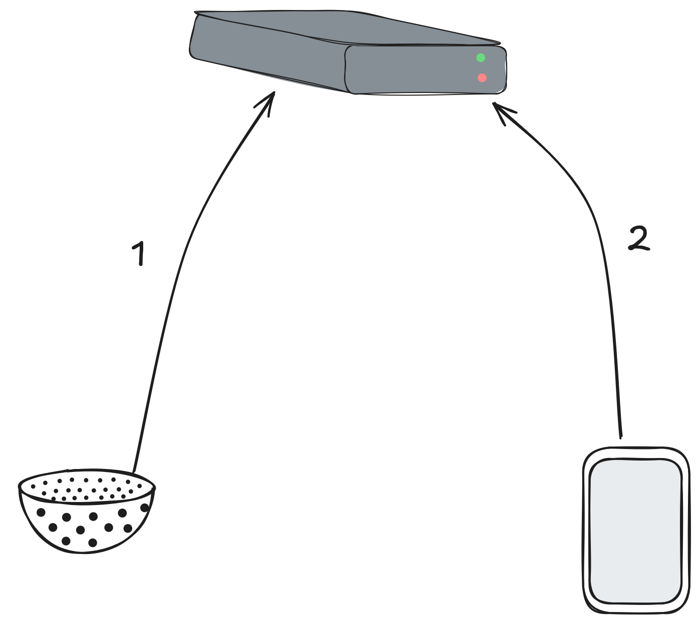
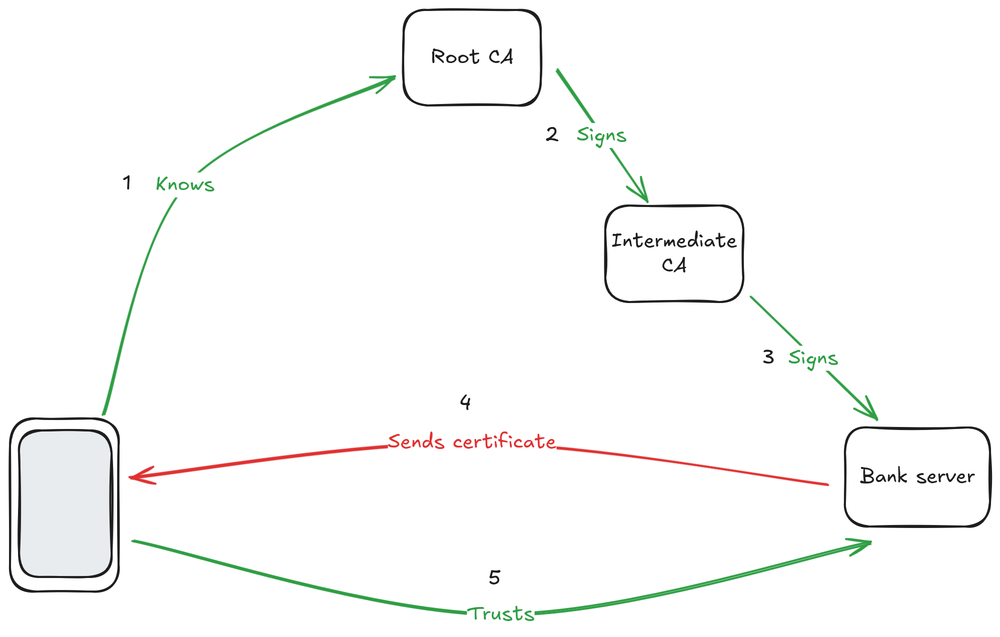

# Security first!

A few months had past and Leiko did a stellar job at creating a first prototype.
Vernes started the hiring process for the production team.
Shuri and Adira wanted to talk with Jules about the security system they have in mind.

"Ok, so, let me draw you a quick picture of how our system will work" said Shuri.

"Now, as you now, our strainer will collect data end send it to our server. That's the arrow number one. Then, whenever they feel like doing so, our customers will use our app on their smart phone which is going to get the data from our server. That's arrow number two."

"So far so good" Jules said.

"Of course, all the data we collect are private data so we don't want anyone to access someone else's data" added Shuri.

"Obviously!" Jules replied, "We just have to make our users create an account with a strong password and that's it! Isn't it?"

"Well, yes, but that won't be enough" Adira objected, "Remember the monster-in-the-middle attack? If you send your password in clear text, then the monster can read it and thus use it."

"Ok, then we just have to get the server's public key and send our password cyphered."

"Yes, well done. However, the monster could pretend to be the server and send you its public key. The monster then has your password and we are back to square one!"

"But, don't we do that everyday on the internet?"

"Yes, totally!" Shuri said, "That's why arrow number two is going to be the easy one. But let me explain to you how it works."

"I am all ears" Jules said.

"So, you found out the main part of how it works. The only missing part is : how do you know you have the correct public key?

The trick is to use a trusted third party. We are going to call that third party a Certificate Authority which we'll abreviate as CA.

Now, let's say you know a CA that you trust.
You can then physically go to their place and ask their public key.
You are now a hundred percent sure of their key.

On the other side, a company, let's say, your bank, wants to create a website to communicate with you.
They can physically go see the same CA and ask them to sign a certificate.
The certificate is a simple text document that contains some usefull data.
To simplify the explaination, we'll focus on only two : the name and the public key.

Then, when you connect to your bank, the server sends you the certificate signed by the CA.
You check the signature and the name written on the certificate. If everything matches, then it means that the CA physically met your bank and verified the public key. In other words, the CA trusts the bank with that public key. Since you trust the CA, by transitivity, you can trust the bank.
"

"But, that is just indirection! Nobody goes to meet a CA!" Jules said.

"Some companies do! Like your computer manufacturer or phone manufacturer. And they ship their hardware with the public keys of some big, well known CAs.", promply replied Adira.

"Ok, so when I buy my phone the information about the CAs are their already. However, you said *some* CA. Why?" Jules asked.

"Well, you probably guessed that the CA becomes a single point of failure. If the CA is compromised, every connection depending on it may be compromised. That quite a big issue when you talk about something the size of the internet!" Adira explained, "Protecting it properly means having physical protections and digital protections close to what movies describes as a high security vault."

"Think bunkers, body guards, biometric security, video surveillance and all this kind of stuff" Shuri described.

"Wait! That's extremely expensive! That means having a certificate signed by such CA would cost a huge amount of money for this kind of companies to earn anything!" Jules observed.

"Yes, that's where an Intermediate CA comes in handy!" Adira started, "An intermediate CA is a CA which got a certificate signed by another CA and paid the corresponding fee. However, that CA is allowed to sign certificates only for a small number of years but with a relaxed security.
For example, instead of meeting you physically, they can simply check that you do have control over the domain name you claim having."

"Or they can make the certificate signature system available online" Shuri added.

"Thus reducing the cost of getting a certificate and making it accessible" Adira concluded.

"Ok, let me draw what I understood" Jules said.

"So, there is a CA on top which my phone knows because my phone's manufacturer emmbedded its public key. Since it's the starting point of everything, I'll call it the Root CA.
The Root CA signs the certificate of an intermediate CA.
That intermediate CA signs the certificate of my bank.
When I connect to my bank, it sends me the certificate.
I check that it's signed by the Intermediate CA and that the Intermediate CA is signed by a Root CA that I know.
That makes a chain of trust that allows me to trust the public key that my bank just gave me.
I then use this key to cypher my password and authenticate to my bank.
Correct?"

"That's a simplified version of it because we didn't get into all the details, but the most important parts are there, so… yes, you get it. The top most CA is indeed called a Root CA. The whole thing is called a Public Key Infrastructure or PKI for short" Adira replied, happy that their CTO understood so quickly.

"And that's totally the way we are going to secure the communication on the second arrow of my drawing!" Shuri added.

"What happens if a Intermediate CA is hacked?" Jules asked.

"Then the Root CA creates a document saying that this Intermediate CA is not valid anymore and publish it for everyone to see" Adira replied.

"That's what we call revoking a certificate. When we validate a certificate, we regularly check that it hasn't been been revoked" Shuri completed.

"Ok, I think I understand. But what about the first arrow? Can't we do exactly the same thing?" Jules asked, puzzled.

"Yes, we can, but we can do even better!" Shuri answered, "The issue with the password is that we still have to send it to the server. That means that if the server is compromised, all password needs to be changed because the server saw them."

"I think I know where this is going. You want the devices to authenticate with a public key too so that they never send the secret. Right?" Jules interrupted out of excitment.

"Yep! But since our strainers are not going to have a domain name, we won't be able to use a standard CA" Adira said, "we are going to need our own PKI."

"And as you know, the Root CA will have to be well protected!" Shuri added.

"I understand. This is key to the security of our whole system. However, we clearly don't have the means to protect it the way you described it.", Jules said, a bit worried.

"Well, we won't have the fate of the whole internet on our shoulders!" Adira started, "Any issue with the Root CA will only impact us. That would be a bump in the road for us but it wouldn't create an apocalypse. I think we can lower the security to something we can afford."

"Ok, that's quite a meeting already and I need a bit of time to wrap my head around all that" Jules interrupted, "I understand that the main subject that we have to discuss now is the protection of our Root CA. What about we tackle that subject another day? Once my brain rested a bit? Next Monday for example?"

"Good for me" Shuri replied.

"Perfect" Adira concluded.

That evening, Jules came home exhausted and slept like a baby.
